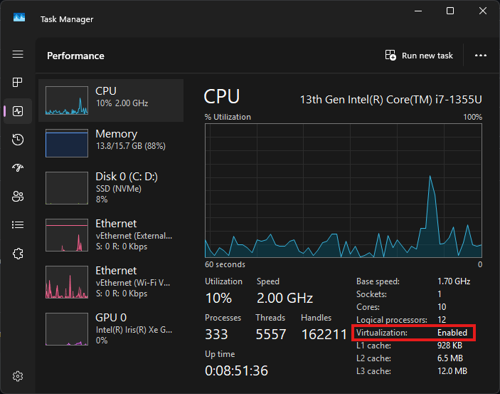

# Windows 11 Developer Setup with WSL 2 and Ubuntu

This guide sets up a clean Windows 11 + WSL 2 + Ubuntu workflow for development and data work. You will install WSL 2, an Ubuntu LTS distro, VS Code with Remote - WSL, core CLI tooling, GitHub CLI, a safer `zsh` setup, Python with `venv`, and Docker Desktop with WSL integration. WSL lets you run a Linux environment directly alongside Windows, without a separate VM UI. ([Microsoft Learn][1])

**Who is this for**

* Windows 11 Home or Pro users (x64) doing development or data work.
* First-time WSL users who want a safe, repeatable setup.

**What you’ll install**

* WSL 2 + Ubuntu LTS (Linux dev environment)
* Google Chrome (default browser)
* Visual Studio Code + Remote - WSL
* Core Ubuntu CLI tools (git, build tools, curl, etc.)
* GitHub CLI (`gh`)
* `zsh` + Oh My Zsh (with minimal, reversible customization)
* Python 3 + `venv`
* Docker Desktop (WSL 2 backend)

**Table of Contents**

* [Before You Start](#before-you-start)
* [Check Virtualization (and Enable if Needed)](#check-virtualization-and-enable-if-needed)
* [Install WSL 2](#install-wsl-2)
* [Install Ubuntu (First Launch Included)](#install-ubuntu-first-launch-included)
* [Make Chrome Your Default (and Connect from WSL)](#make-chrome-your-default-and-connect-from-wsl)
* [Install Visual Studio Code](#install-visual-studio-code)

  * [Connect VS Code to Ubuntu (Remote - WSL)](#connect-vs-code-to-ubuntu-remote---wsl)
  * [Recommended VS Code Extensions](#recommended-vs-code-extensions)
* [Essential Command-Line Tools](#essential-command-line-tools)
* [Install GitHub CLI (gh)](#install-github-cli-gh)
* [Install Oh My Zsh (and Make zsh Your Default)](#install-oh-my-zsh-and-make-zsh-your-default)
* [Link Ubuntu to Your Windows Default Browser](#link-ubuntu-to-your-windows-default-browser)
* [Install Python 3 and venv](#install-python-3-and-venv)
* [Install Docker (WSL 2 Backend)](#install-docker-wsl-2-backend)
* [Post-Install Verification (Run These Now)](#post-install-verification-run-these-now)
* [Troubleshooting & Common Pitfalls](#troubleshooting--common-pitfalls)
* [Uninstall / Cleanup](#uninstall--cleanup)

---

## Before You Start

### Prerequisites

* **Windows 11 (x64)**: Home or Pro.
* **Admin access**: You must be able to run PowerShell as Administrator.
* **Internet**: Required for downloads and package installs.
* **Disk space**: Aim for **20 GB free** (more if you plan to use Docker images heavily).
* **Hardware virtualization**: Must be enabled (you will verify this next).

### What you will have at the end

* Ubuntu LTS running on WSL 2.
* VS Code editing inside Ubuntu via Remote - WSL.
* Git + build tools inside Ubuntu.
* GitHub CLI authenticated to your GitHub account.
* Python virtual environments working cleanly.
* Docker working from Ubuntu via Docker Desktop’s WSL integration. ([Microsoft Learn][2])

### Why this matters

This setup keeps Linux tooling inside Linux (Ubuntu), and Windows tooling inside Windows, while letting them work together cleanly. Microsoft explicitly recommends storing project files on the same OS as the tools you use. ([Microsoft Learn][3])

---

## Check Virtualization (and Enable if Needed)

WSL 2 uses virtualization. If virtualization is off, WSL 2 and Docker will fail or run poorly. Microsoft documents how to enable virtualization in UEFI/BIOS and then enable the required Windows feature. ([Microsoft Support][4])

### 1) Verify virtualization is enabled (Windows)

#### Task Manager

1. Press `Ctrl + Shift + Esc`.
2. Go to **Performance** → **CPU**.
3. Look for **Virtualization: Enabled**.



### 2) Enable virtualization in UEFI/BIOS (high level)

#### Why this matters

Windows features cannot “fake” virtualization. If it’s disabled in firmware, WSL 2 cannot use it.

#### Vendor-agnostic steps (safe-by-default)

1. Save your work and close apps.
2. Open **Settings** → **System** → **Recovery**.
3. Under **Advanced startup**, choose **Restart now**.
4. Choose **Troubleshoot** → **Advanced options** → **UEFI Firmware Settings** → **Restart**.
5. In the firmware UI, find a setting named something like:

   * “Intel Virtualization Technology (VT-x)”
   * “AMD SVM”
   * “Virtualization”
6. Enable it, then **Save & Exit**.

Microsoft’s official “Enable virtualization” guide includes these UEFI entry steps and notes to change only what you need. ([Microsoft Support][4])

#### Manufacturer docs (official)

* Dell: “How to enable or disable hardware virtualization on Dell systems.” ([Dell][5])
* Lenovo: “How to enable Virtualization Technology on Lenovo computers.” ([Lenovo Support][6])
* ASUS: “How to set VT (Virtualization Technology) in BIOS and UEFI.” ([Asus][7])

---

## Install WSL 2

### Why this matters

WSL is now a regularly updated component. Microsoft documents installation with `wsl --install` and recommends using current WSL versions for features and fixes. ([Microsoft Learn][9])

### 1) Install WSL (without a distro first)

Open **PowerShell as Administrator** and run:

```powershell
wsl --install --no-distribution
```

This installs WSL and required components without choosing a Linux distro yet. Microsoft documents `--no-distribution` as an install option. ([Microsoft Learn][10])

Restart if prompted.

### 2) Update WSL (recommended)

After restart, open PowerShell and run:

```powershell
wsl --update
```

Microsoft documents updating WSL via `wsl.exe --update`. ([Microsoft Learn][8])

### Verify

Run:

```powershell
wsl --version
wsl --status
```

Expected (example):

```text
WSL version: 2.x.x
Kernel version: 5.15.x.x
WSLg version: 1.x.x
```

If `wsl --version` is not recognized, your WSL may be older; ensure Windows Update is current and re-run `wsl --update`. See Microsoft’s WSL troubleshooting page for update guidance. ([Microsoft Learn][8])

---

## Install Ubuntu (First Launch Included)

### Why Ubuntu LTS

Ubuntu LTS versions are the most common target for developer tooling and long-lived environments. Canonical documents installing Ubuntu via WSL and using `wsl --list --online` to choose a distro. ([Ubuntu Documentation][11])

### 1) Pick and install Ubuntu LTS

Open PowerShell and list available distros:

```powershell
wsl --list --online
```

Install Ubuntu 24.04 LTS (or the newest Ubuntu LTS shown in your list):

```powershell
wsl --install -d Ubuntu-24.04
```

If the install appears stuck at 0%, Microsoft documents using `--web-download` as a workaround. ([Microsoft Learn][9])

### 2) First launch: create your Linux user

Launch Ubuntu from the Start menu (search “Ubuntu 24.04 LTS”), or run:

```powershell
wsl -d Ubuntu-24.04
```

On first launch, Ubuntu will ask you to create:

* A Linux username (lowercase, no spaces is easiest).
* A password (typing will not show characters; this is normal).

### 3) Update packages (inside Ubuntu)

In the Ubuntu terminal:

```bash
sudo apt update
sudo apt -y upgrade
sudo apt -y autoremove
```

### 4) Set locale/timezone (only if you see issues)

Most WSL installs are fine by default. If you see locale warnings, run:

```bash
sudo dpkg-reconfigure locales
```

If you need to adjust timezone:

```bash
sudo dpkg-reconfigure tzdata
```

### Verify

In Ubuntu:

```bash
lsb_release -a
uname -a
```

Expected (example):

```text
Distributor ID: Ubuntu
Description:    Ubuntu 24.04 LTS
Release:        24.04
Codename:       noble
```

Also verify WSL version from Windows PowerShell:

```powershell
wsl -l -v
```

Expected (example):

```text
  NAME            STATE           VERSION
* Ubuntu-24.04    Running         2
```

Microsoft documents using `wsl.exe --list --verbose` (`wsl -l -v`) to confirm distro versions. ([Microsoft Learn][9])

---

## Make Chrome Your Default (and Connect from WSL)

### Why this matters

Most developer workflows assume a modern browser with strong extension support and devtools. Using one default browser reduces “where did that link open?” friction.

### 1) Install Chrome on Windows

Download and install Google Chrome from the official site:

* [https://www.google.com/chrome/](https://www.google.com/chrome/)

### 2) Set Chrome as the default browser (Windows 11)

1. Open **Settings** → **Apps** → **Default apps**.
2. Select **Google Chrome**.
3. Choose **Set default** (or set Chrome for `HTTP` and `HTTPS`).

Microsoft documents changing default apps in Windows Settings. ([Microsoft Support][4])

### 3) Quick WSL link opening (temporary)

Even before configuring `xdg-open`, you can open a URL from Ubuntu using Windows interop:

```bash
powershell.exe -NoProfile -Command "Start-Process https://example.com"
```

WSL can run Windows executables directly from Linux (interop). ([Microsoft Learn][12])

### Verify

In Ubuntu:

```bash
powershell.exe -NoProfile -Command "Start-Process https://example.com"
```

Expected result: your default Windows browser opens the page.

---

## Install Visual Studio Code

### Why this matters

VS Code + Remote - WSL gives you Windows UI with Linux tooling, without copying projects back and forth. Microsoft’s WSL environment guide explicitly calls out opening a WSL project with `code .`. ([Microsoft Learn][3])

### 1) Install VS Code on Windows

Download and install VS Code:

* [https://code.visualstudio.com/](https://code.visualstudio.com/)

During install, enable options like:

* “Add to PATH” (recommended)
* “Open with Code” context menu (optional)

### Verify

In **PowerShell**:

```powershell
code --version
```

Expected (example):

```text
1.xx.x
xxxxxxxxxxxxxxxxxxxxxxxxxxxxxxxxxxxxxxxx
x64
```

### Connect VS Code to Ubuntu (Remote - WSL)

1. Open VS Code on Windows.
2. Install the **Remote - WSL** extension (see next section).
3. Open Ubuntu (WSL) and go to your home directory:

```bash
cd ~
```

4. Create a workspace folder for projects:

```bash
mkdir -p ~/code
cd ~/code
```

5. Launch VS Code connected to WSL:

```bash
code .
```

If this is your first time, VS Code will install a small server component inside Ubuntu.

#### Verify the remote connection

In VS Code, look for the bottom-left indicator showing **WSL: Ubuntu-24.04** (or similar). Then in the integrated terminal inside VS Code, run:

```bash
pwd
```

Expected (example):

```text
/home/<your-linux-username>/code
```

Also verify `code` works from Ubuntu:

```bash
code --version
```

### Recommended VS Code Extensions

Required for this guide:

* Remote - WSL: [https://marketplace.visualstudio.com/items?itemName=ms-vscode-remote.remote-wsl](https://marketplace.visualstudio.com/items?itemName=ms-vscode-remote.remote-wsl)

Recommended (common dev/data stack):

* Python: [https://marketplace.visualstudio.com/items?itemName=ms-python.python](https://marketplace.visualstudio.com/items?itemName=ms-python.python)
* Pylance: [https://marketplace.visualstudio.com/items?itemName=ms-python.vscode-pylance](https://marketplace.visualstudio.com/items?itemName=ms-python.vscode-pylance)
* Jupyter: [https://marketplace.visualstudio.com/items?itemName=ms-toolsai.jupyter](https://marketplace.visualstudio.com/items?itemName=ms-toolsai.jupyter)
* GitLens: [https://marketplace.visualstudio.com/items?itemName=eamodio.gitlens](https://marketplace.visualstudio.com/items?itemName=eamodio.gitlens)
* EditorConfig: [https://marketplace.visualstudio.com/items?itemName=EditorConfig.EditorConfig](https://marketplace.visualstudio.com/items?itemName=EditorConfig.EditorConfig)
* YAML: [https://marketplace.visualstudio.com/items?itemName=redhat.vscode-yaml](https://marketplace.visualstudio.com/items?itemName=redhat.vscode-yaml)
* Docker: [https://marketplace.visualstudio.com/items?itemName=ms-azuretools.vscode-docker](https://marketplace.visualstudio.com/items?itemName=ms-azuretools.vscode-docker)

Optional nice-to-haves:

* Prettier: [https://marketplace.visualstudio.com/items?itemName=esbenp.prettier-vscode](https://marketplace.visualstudio.com/items?itemName=esbenp.prettier-vscode)
* Markdownlint: [https://marketplace.visualstudio.com/items?itemName=DavidAnson.vscode-markdownlint](https://marketplace.visualstudio.com/items?itemName=DavidAnson.vscode-markdownlint)

### If something goes wrong

* VS Code Remote troubleshooting: [https://code.visualstudio.com/docs/remote/troubleshooting](https://code.visualstudio.com/docs/remote/troubleshooting) ([Visual Studio Code][13])

---

## Essential Command-Line Tools

Install these inside Ubuntu (WSL). They cover downloads, building, archives, editors, and basic utilities.

### Install (Ubuntu)

```bash
sudo apt update
sudo apt install -y \
  build-essential \
  curl \
  git \
  make \
  nano \
  unzip \
  vim \
  wget \
  zip
```

### Verify

```bash
git --version
curl --version
gcc --version
make --version
wget --version
unzip -v | head -n 1
```

Expected (example):

```text
git version 2.xx.x
curl 8.x.x ...
gcc (Ubuntu ...) 13.x.x
GNU Make 4.x
GNU Wget 1.x
UnZip 6.00 ...
```

---

## Install GitHub CLI (gh)

### Why this matters

`gh` makes GitHub auth, cloning, PRs, and issues smoother from the terminal. GitHub’s maintainers publish official Debian/Ubuntu packages and document the apt repository setup. ([GitHub][14])

### Install (Ubuntu)

```bash
sudo apt update
sudo apt install -y wget gpg
sudo mkdir -p -m 755 /etc/apt/keyrings
wget -nv -O /tmp/githubcli-keyring.gpg https://cli.github.com/packages/githubcli-archive-keyring.gpg
sudo mv /tmp/githubcli-keyring.gpg /etc/apt/keyrings/githubcli-archive-keyring.gpg
sudo chmod go+r /etc/apt/keyrings/githubcli-archive-keyring.gpg
```

```bash
ARCH="$(dpkg --print-architecture)"
sudo tee /etc/apt/sources.list.d/github-cli.list > /dev/null <<EOF
deb [arch=${ARCH} signed-by=/etc/apt/keyrings/githubcli-archive-keyring.gpg] https://cli.github.com/packages stable main
EOF
```

```bash
sudo apt update
sudo apt install -y gh
```

### Authenticate (browser flow)

```bash
gh auth login
```

Choose:

* **GitHub.com**
* **HTTPS**
* **Login with a web browser**

### Verify

```bash
gh --version
gh auth status
```

Expected (example):

```text
gh version 2.xx.x (202x-xx-xx)
Logged in to github.com as <your-username> ...
```

### Repo clone smoke test

```bash
cd ~/code
gh repo clone cli/cli gh-cli-smoke-test
cd gh-cli-smoke-test
git remote -v
```

Expected (example):

```text
origin  https://github.com/cli/cli.git (fetch)
origin  https://github.com/cli/cli.git (push)
```

---

## Install Oh My Zsh (and Make zsh Your Default)

### Why this matters

`zsh` improves interactive shell ergonomics (completion, prompt theming), while Oh My Zsh organizes configuration. Oh My Zsh is installed via its published installer script; do not run it blindly. Download it first, inspect it, then run it. ([GitHub][15])

### 1) Install `zsh` (Ubuntu)

```bash
sudo apt update
sudo apt install -y zsh
```

### 2) Download and inspect the Oh My Zsh installer (recommended safe flow)

```bash
cd ~
curl -fsSL -o omz-install.sh https://raw.githubusercontent.com/ohmyzsh/ohmyzsh/master/tools/install.sh
less omz-install.sh
```

If it looks reasonable, run it:

```bash
sh omz-install.sh
rm -f omz-install.sh
```

### 3) Add plugins + theme (minimal, popular defaults)

```bash
ZSH_CUSTOM="${ZSH_CUSTOM:-$HOME/.oh-my-zsh/custom}"
git clone https://github.com/zsh-users/zsh-autosuggestions "${ZSH_CUSTOM}/plugins/zsh-autosuggestions"
git clone https://github.com/zsh-users/zsh-syntax-highlighting "${ZSH_CUSTOM}/plugins/zsh-syntax-highlighting"
git clone --depth=1 https://github.com/romkatv/powerlevel10k.git "${ZSH_CUSTOM}/themes/powerlevel10k"
```

### 4) Minimal `.zshrc` (small, reversible)

Path: `~/.zshrc`

```text
export ZSH="$HOME/.oh-my-zsh"

ZSH_THEME="powerlevel10k/powerlevel10k"

plugins=(
  git
  zsh-autosuggestions
  zsh-syntax-highlighting
)

source $ZSH/oh-my-zsh.sh
```

Reload:

```bash
exec zsh
```

### 5) Make `zsh` your default shell

```bash
chsh -s /usr/bin/zsh
```

Close the Ubuntu terminal and reopen it.

### Verify

```bash
zsh --version
echo "$SHELL"
```

Expected (example):

```text
zsh 5.9 (x86_64-ubuntu-linux-gnu)
/usr/bin/zsh
```

### Revert (important)

If you want to go back to bash:

```bash
chsh -s /bin/bash
rm -rf ~/.oh-my-zsh
```

Then open a new terminal.

---

## Link Ubuntu to Your Windows Default Browser

### Why this matters

Many CLI tools open docs and auth links. You want `xdg-open` inside Ubuntu to open in your Windows default browser.

### 1) Install `wslview` (via `wslu`)

`wslu` provides `wslview`, described as a tool to open links in the default Windows browser from WSL. ([wslu.wedotstud.io][16])

```bash
sudo apt update
sudo apt install -y wslu
```

### 2) Route `xdg-open` to `wslview`

Create a small wrapper that takes precedence in your PATH.

Path: `/usr/local/bin/xdg-open`

```bash
sudo tee /usr/local/bin/xdg-open > /dev/null <<'EOF'
#!/usr/bin/env sh
exec wslview "$@"
EOF
```

```bash
sudo chmod +x /usr/local/bin/xdg-open
```

### 3) Set a default browser command (optional but helpful)

Path: `~/.zshrc`

```text
export BROWSER="wslview"
```

Reload:

```bash
exec zsh
```

### Verify

```bash
wslview https://example.com
xdg-open https://example.com
```

Expected result: the link opens in your **Windows default browser**.

---

## Install Python 3 and venv

### Why this matters

Python virtual environments isolate dependencies per project. Python’s `venv` module creates lightweight environments with their own site directories, separate from the base interpreter. ([Python documentation][17])

### 1) Install Python + pip + venv (Ubuntu)

```bash
sudo apt update
sudo apt install -y python3 python3-pip python3-venv
```

### 2) Create and use a virtual environment

From your project folder:

```bash
cd ~/code
mkdir -p python-sandbox
cd python-sandbox
python3 -m venv .venv
```

Activate:

```bash
source .venv/bin/activate
```

Deactivate:

```bash
deactivate
```

### 3) pip configuration (where it lives, and how to view it)

pip supports configuration via files, environment variables, and command line options; `pip config` helps manage it. ([Pip Documentation][18])

Show pip config debug output:

```bash
python3 -m pip config debug
```

Optional (recommended): create a per-user pip config file location:

Path: `~/.config/pip/pip.conf`

```text
[global]
require-virtualenv = true
```

If you set `require-virtualenv = true`, pip installs will fail outside an activated venv. This is deliberate. It reduces accidental global installs.

### 4) Freeze dependencies

With your venv active:

```bash
source .venv/bin/activate
python -m pip install --upgrade pip
python -m pip freeze > requirements.txt
```

### Verify

```bash
python3 --version
pip --version
python3 -m venv --help | head -n 1
```

Expected (example):

```text
Python 3.12.x
pip 24.x from ... (.venv or /usr/lib/...)
usage: venv ...
```

Also verify the venv runs Python:

```bash
python3 -m venv .venv-test
source .venv-test/bin/activate
python -c "print('ok')"
deactivate
rm -rf .venv-test
```

Expected:

```text
ok
```

---

## Install Docker (WSL 2 Backend)

### Why this matters

Docker Desktop on Windows can use the WSL 2 backend and integrate directly with your Ubuntu distro, so `docker` works inside WSL. Microsoft documents Docker Desktop + WSL 2 setup in its WSL containers tutorial. ([Microsoft Learn][2])

### 1) Install Docker Desktop (Windows)

1. Download Docker Desktop:

   * [https://www.docker.com/products/docker-desktop/](https://www.docker.com/products/docker-desktop/)
2. Run the installer.
3. When asked, ensure **WSL 2** is selected as the backend (recommended).

### 2) Enable WSL integration for Ubuntu

1. Open **Docker Desktop**.
2. Go to **Settings**.
3. Enable **Use the WSL 2 based engine** (Windows-only option). Docker’s settings docs describe this option and warn about security implications for other settings like exposing the daemon. ([Docker Documentation][19])
4. Go to **Resources** → **WSL Integration**.
5. Enable integration for **Ubuntu-24.04**.
6. Apply & Restart if prompted.

### 3) Use Docker from Ubuntu (WSL)

Open Ubuntu and run:

```bash
docker version
docker run --rm hello-world
```

### Verify

```bash
docker version
```

Expected (example):

```text
Client: Docker Engine - Community
Server: Docker Engine - Community
```

```bash
docker run --rm hello-world
```

Expected (example):

```text
Hello from Docker!
This message shows that your installation appears to be working correctly.
```

If Docker commands fail inside WSL, re-check Docker Desktop’s WSL integration settings and confirm your distro is WSL 2 (`wsl -l -v`). ([Microsoft Learn][9])

---

## Post-Install Verification (Run These Now)

Run these checks to confirm the full setup works.

### Windows (PowerShell)

```powershell
wsl --version
wsl -l -v
```

Expected (example):

```text
WSL version: 2.x.x
  NAME            STATE           VERSION
* Ubuntu-24.04    Running         2
```

### Ubuntu (WSL)

```bash
lsb_release -a
gh --version
code --version
zsh --version
python3 --version
pip --version
python3 -m venv .venv && source .venv/bin/activate && python -c "print('ok')"
```

Expected (example):

```text
Distributor ID: Ubuntu
Description:    Ubuntu 24.04 LTS
...
gh version 2.xx.x ...
1.xx.x
zsh 5.x ...
Python 3.12.x
pip 24.x ...
ok
```

### Docker (Ubuntu / WSL)

```bash
docker version
docker run --rm hello-world
```

Expected (example):

```text
Client: Docker Engine - Community
Server: Docker Engine - Community
Hello from Docker!
```

---

## Troubleshooting & Common Pitfalls

### WSL won’t install / “Virtualization not enabled” / error `0x80370102`

* Confirm **Virtualization: Enabled** in Task Manager.
* Confirm firmware virtualization is enabled (UEFI/BIOS).
* Confirm Windows features are enabled (see [Check Virtualization](#check-virtualization-and-enable-if-needed)).
* Use Microsoft’s WSL troubleshooting guide for the specific error code. ([Microsoft Learn][8])

### `wsl --version` not recognized

* Run:

```powershell
wsl --update
```

Microsoft documents `wsl.exe --update` as the way to update WSL. ([Microsoft Learn][8])

### `code .` fails in Ubuntu

* Open VS Code on Windows once.
* Ensure Remote - WSL is installed.
* Try again from Ubuntu in a folder you own (e.g., `~/code`).
* Microsoft’s WSL environment guide shows `code .` usage from a WSL project directory. ([Microsoft Learn][3])

### Links opened from Ubuntu don’t open in Windows

* Verify `wslview` and your `xdg-open` wrapper:

```bash
command -v wslview
command -v xdg-open
xdg-open https://example.com
```

`wslview` is described by `wslu` as a “fake WSL browser” to open links in the default Windows browser. ([wslu.wedotstud.io][16])

### Docker works in Windows but not in Ubuntu (WSL)

* In PowerShell, confirm WSL 2:

```powershell
wsl -l -v
```

* In Docker Desktop, confirm:

  * “Use the WSL 2 based engine” is enabled. ([Docker Documentation][19])
  * WSL Integration is enabled for your Ubuntu distro. ([Microsoft Learn][2])

---

## Uninstall / Cleanup

### Uninstall a WSL distro (Ubuntu) safely

This deletes the Linux filesystem for that distro. Back up anything you need first.

In PowerShell:

```powershell
wsl --shutdown
wsl --unregister Ubuntu-24.04
```

Verify:

```powershell
wsl -l -v
```

### Remove WSL features (optional)

If you want to remove WSL entirely (rare), you can disable the optional features:

```powershell
dism.exe /online /disable-feature /featurename:Microsoft-Windows-Subsystem-Linux /norestart
dism.exe /online /disable-feature /featurename:VirtualMachinePlatform /norestart
shutdown.exe /r /t 0
```

Microsoft documents enabling/disabling these components as part of WSL troubleshooting and setup flows. ([Microsoft Learn][8])

### Uninstall Docker Desktop and VS Code

* **Docker Desktop**: Settings → Apps → Installed apps → Docker Desktop → Uninstall.
* **VS Code**: Settings → Apps → Installed apps → Microsoft Visual Studio Code → Uninstall.
* **Chrome**: Settings → Apps → Installed apps → Google Chrome → Uninstall.

If you later reinstall WSL, return to [Install WSL 2](#install-wsl-2) and proceed in order.

[1]: https://learn.microsoft.com/en-us/windows/wsl/about?utm_source=chatgpt.com "What is Windows Subsystem for Linux"
[2]: https://learn.microsoft.com/en-us/windows/wsl/tutorials/wsl-containers?utm_source=chatgpt.com "Get started with Docker remote containers on WSL 2"
[3]: https://learn.microsoft.com/en-us/windows/wsl/setup/environment?utm_source=chatgpt.com "Set up a WSL development environment"
[4]: https://support.microsoft.com/en-us/windows/enable-virtualization-on-windows-c5578302-6e43-4b4b-a449-8ced115f58e1?utm_source=chatgpt.com "Enable Virtualization on Windows"
[5]: https://www.dell.com/support/kbdoc/en-us/000195978/how-to-enable-or-disable-hardware-virtualization-on-dell-systems?utm_source=chatgpt.com "How To Enable or Disable Hardware Virtualization on Dell ..."
[6]: https://support.lenovo.com/us/en/solutions/ht500006-how-to-enable-virtualization-technology-on-lenovo-computers?utm_source=chatgpt.com "How to enable Virtualization Technology on Lenovo PC ..."
[7]: https://www.asus.com/sa-en/support/faq/1045141/?utm_source=chatgpt.com "How to set VT(Virtualization Technology) in BIOS and ..."
[8]: https://learn.microsoft.com/en-us/windows/wsl/troubleshooting?utm_source=chatgpt.com "Troubleshooting Windows Subsystem for Linux"
[9]: https://learn.microsoft.com/en-us/windows/wsl/install?utm_source=chatgpt.com "How to install Linux on Windows with WSL"
[10]: https://learn.microsoft.com/en-us/windows/wsl/basic-commands?utm_source=chatgpt.com "Basic commands for WSL"
[11]: https://documentation.ubuntu.com/wsl/stable/howto/install-ubuntu-wsl2/?utm_source=chatgpt.com "Install Ubuntu on WSL 2"
[12]: https://learn.microsoft.com/en-us/windows/wsl/filesystems?utm_source=chatgpt.com "Working across Windows and Linux file systems"
[13]: https://code.visualstudio.com/docs/remote/troubleshooting?utm_source=chatgpt.com "Remote Development Tips and Tricks"
[14]: https://raw.githubusercontent.com/cli/cli/trunk/docs/install_linux.md "raw.githubusercontent.com"
[15]: https://github.com/ohmyzsh/ohmyzsh/wiki?utm_source=chatgpt.com "Home · ohmyzsh/ohmyzsh Wiki"
[16]: https://wslu.wedotstud.io/wslu/ "wslu | wslu Wiki"
[17]: https://docs.python.org/3/library/venv.html?utm_source=chatgpt.com "venv — Creation of virtual environments"
[18]: https://pip.pypa.io/en/stable/topics/configuration/?utm_source=chatgpt.com "Configuration - pip documentation v25.3"
[19]: https://docs.docker.com/desktop/settings-and-maintenance/settings/?utm_source=chatgpt.com "Change your Docker Desktop settings"
